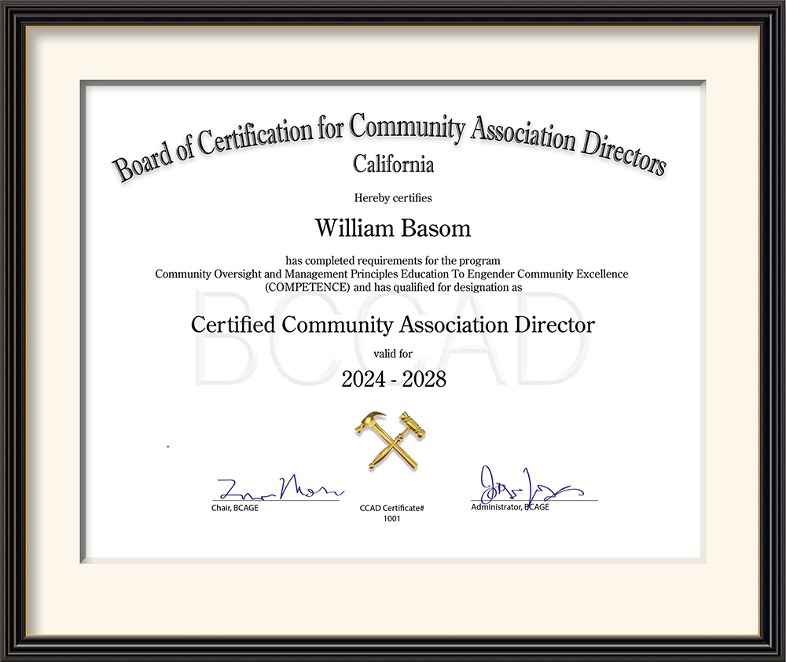
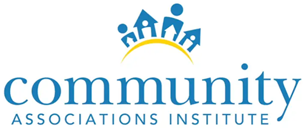
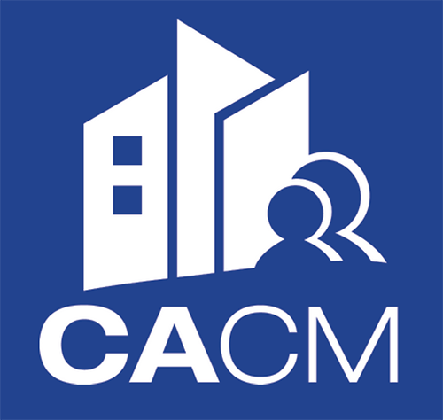
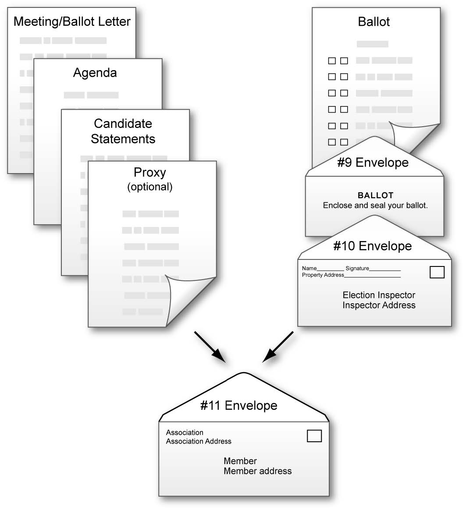
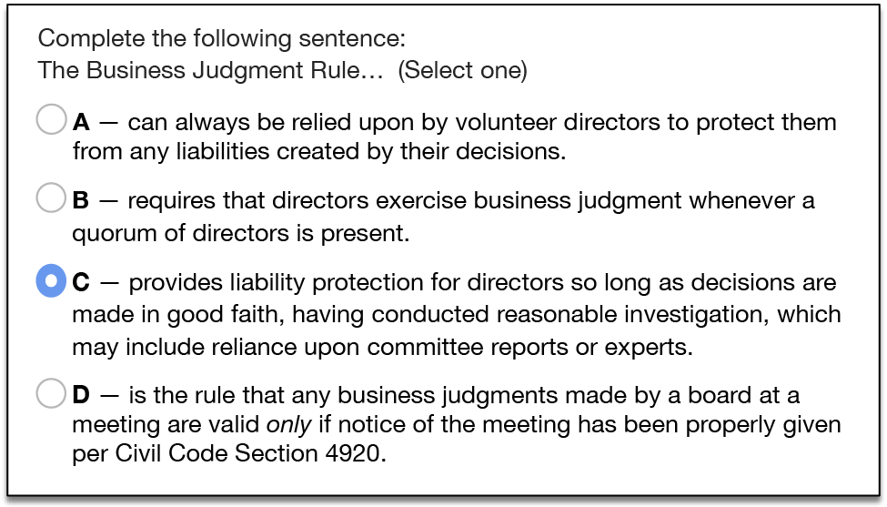
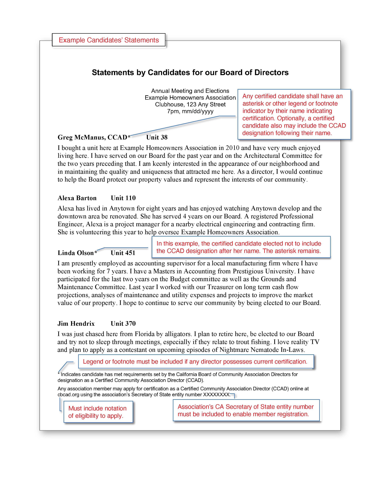
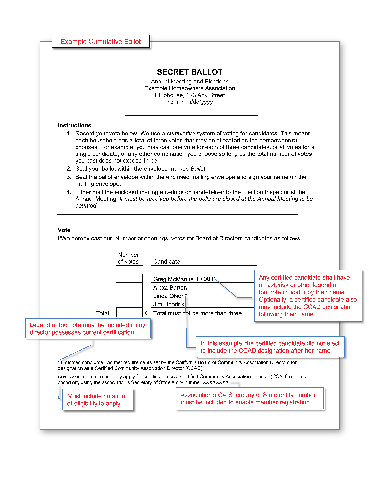
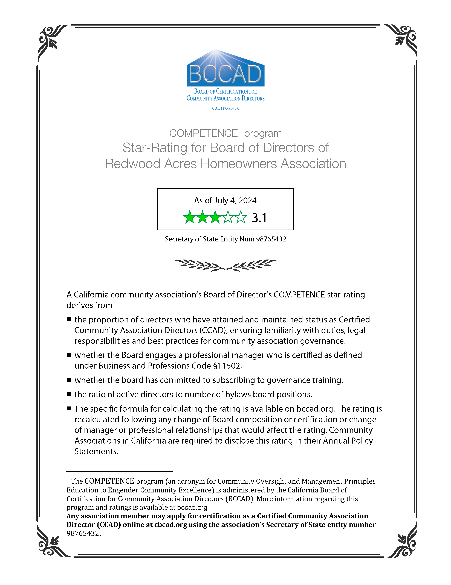

Proposal for establishing the California Board of Certification for Community Association Directors

___

The persistent problem of recruiting qualified directors
========================================================

How many corporations exist with directors responsible to protect a large portion of stakeholders' equity typically have so little demonstrated applicable experience, competence, or knowledge of their duties or legal responsibilities?

HOA managers and attorneys too often witness the dearth of volunteers and the inordinate costs in time and funds wasted by HOA Boards attempting to navigate issues affected by laws and best practices about which directors are unaware — and time and costs for recovering from consequences of actions taken without such knowledge.

Pool of qualified candidates varies with community size
-------------------------------------------------------

Populations of most towns and cities usually are sufficient to ena­ble competitive elections and town- and city-councils with talents in disciplines applicable to operating their governments. However, the comparatively small population of most home­owners associa­tions often means a dearth of board candidates, many without applicable qualifica­tions. Often, HOA boards find themselves with directors with virtually *no experience* in business, finance, law, construction or many other applicable fields.

HOAs with underqualified directors are the rule — not the exception
---------------------------------------------------------------------

HOA boards with under-qualified directors can have profound negative and costly effects on the lives of their members.

In my over thirty-years on HOA boards and committees, I've found well-meaning volunteers in a neighborhood setting tend to conduct meetings within a social context wherein decisions are heavily influenced by uninformed sensibilities and impulses of neighbors present, sans due diligence and investigation, consideration of state regulation or standards of governance intended to protect broader interests.

Mere availability of director education hasn't been sufficient
--------------------------------------------------------------

Even if a well-trained volunteer is elected and advocates for established best practices and legal compliance, such informed advice is often disregarded with deference given to an opposing director's longevity or assertiveness, or to expedience or politics. Statutes and case law may as well not exist unless *multiple* directors are aware of them. Often, only when a *second* director reinforces and validates a director's advice as deriving from an authoritative source, does the dynamic change; only then are directors apt to heed the advice.

To improve board perfor­mance in communities across our state, we must find a way to increase community associa­tion members' partici­pa­tion on boards and ensure broader exposure of directors to best practices, statutes and case law.

Certification to an estab­lished baseline of knowledge and continuing education to maintain minimum standards is mandated in Business and Professions code for attorneys, physicians, real estate professionals and a myriad of other vocations with the potential to affect consumers' welfare. Decisions by HOA directors also may profoundly affect HOA members' interests. Even so, while performance requirements exist, education requirements making directors aware of them are conspicuously absent.

Conventional licensing could hobble recruitment
===============================================

Consider this argument against making director education compulsory through legislation to require licensing:

> "HOA directors are volunteers and many HOAs have difficulty recruiting sufficient volunteers for their boards. An increased burden of required education may dissuade potential volunteers, further exacerbating recruitment."

At least one state, Florida, did try a licensing model. (See below.)

A flawed model
--------------

We can learn from the Florida model, which loosely follows consumer protection licensing requirements, ostensibly requiring training to minimum standards. However, presumably to address the objection that licensing would discourage potential volunteers, the legislature created a glaring loophole which, in my opinion, effectively nullifies the program's purpose: A would-be director may circumvent training or passing an exam simply by indicating in writing to the secretary they have read the governing documents and agree to uphold them.

While this may have been a compromise to enable bill passage, foreseeably it could be fatal to the purpose of informed governance.

*With a twist on the licensing model, California can do better.*

Rather than compel, California can *incent* education
=====================================================

I propose that ECHO, CAI, CACM and other community association-oriented trade groups advocate for state legislation to enable a program that would *incent members to participate on their associations' boards, and to seek to educate themselves* as directors and for boards to encourage directors' education. (See [*Summary of state legislation required to enable program*](#summary_of_state_legislation).)

The state would not *require* community association directors be licensed; thus, community associations may continue to operate as they have without fear of a requirement that might discourage members from volunteering. However...

There would be incentives for those associations that encourage their directors to become *certified*. (See [*Multiple broad benefits*](#multiple_benefits).)

First, legislation would create a new Civil Code Section 6200 to Division 4, Part 5, Chapter 12 that would

- enable establishing a public-facing non-profit corporation, for example, the *Board of Certification for Community Association Directors* (BCCAD), to establish and administer the program described herein.

- create the credential for community association members, *Certified Community Association Director*.

- enable such an organization to administer tests and grant certifications to citizens who meet standards of knowledge of best practices and basic legal requirements for governance of state community associations.

- enable maintenance of certification records and making such records publicly accessible.

- authorize such organization to coordinate with the Secretary of State to enable key linkage with their community association database records to facilitate records maintenance and avoid unnecessary duplication.

- enable the organization to employ such records to create a community association scoring system derived principally by the proportion of directors certified under this program.

- require adherence to a code of ethics and standards of practice for community association directors.

- add new Civil Code §5105(a)(8) to require that any candidate certified under this program be identified as such on any election ballot or list of candidates.

Director certifications could earn benefits for their associations
------------------------------------------------------------------

The BCCAD would assign *ratings* to communities based generally upon the propor­tion of its directors with current certifications and foster an environment wherein communities with higher ratings may garner favored insurance premiums and prestige of being identified by the state as being in the top-10, top-100, top-1000.

Real estate values in communities who can boast such ratings may benefit and provide a strong incentive for members to keep electing candidates who are certified. Those that do not risk being at a disadvantage.

Other benefits may be fostered as well, such as discounts from services vendors, whom may justify discounts as educated boards are easier and more profitable to work with. (See [*Multiple broad benefits*](#multiple_benefits).)

Board of Certification for Community Association Directors (BCCAD
=========================================================

The BCCAD would

- operate as required under a new Civil Code Section 6200.

- maintain or have access to a database of all California residential CIDs, indexed by State Department entity number, ensuring uniqueness of the CID and facilitating compatibility and coordination of databases.

- maintain a database of all CID members registered under the program and their certifications and credits. (Every participant would have a unique database key enabling linking to more than one CID in the participant database.)

- maintain online accessibility of each participant's certification and credits status.

- establish standards for an educational program known as the <abbr>COMPETENCE</abbr> training program, an acronym for
**C**ommunity **O**versight and **M**anagement **P**rinciples
**E**ducation **T**o **E**ngender **C**ommunity **E**xcellence. (This acronym also complements the preferred means of attaining certification — through the [^1]*Competency Based Education* method. See the US Department of Education explanation of this method, below.)

- establish a <abbr>COMPETENCE</abbr>-star-rating system for community association boards, derived from a formula that includes the percentage of its directors with a current certification as well as whether it is actively managed by a CCAM-certified manager. (See [Determination of community association COMPETENCE star rating](#star_rating_determination)</a>).

- provide coordinating resources, including CE credit standards, for independent organizations, such as ECHO and CAI that already provide education for CID directors. This would enable such organizations to be approved and participate as partners in training, reducing or eliminating training burden for BCCAD. While BCCAD may create and administer training programs, it also would have the option of allowing training solely through such independent organizations should it determine they provide necessary training and accessibility to communities.

- promote directors' and members' participation in approved training to instill knowledge of duties, legal responsibilities and best practices for community association directors — to qualify as
*Certified Community Association Directors.* This also may have the effect of encouraging directors to become members of education organizations like ECHO and CAI to assist with continuing education to maintain director certifications.

- provide testing and certify applicants who have successfully passed an exam that could be conveniently taken online.

- ensure BCCAD and/or independent online training and continuing education resources are accessible for community association members statewide. This would include

- a secure internet website for participating community associations and applicants to register and for applicants to take exams.

- (For BCCAD) a secure internet website for facilitating communications with approved independent training organizations.

- (optional) a secure internet website enabling independent materials authors to submit course materials and online exam questions electronically.

- respond to participants' and educational institutions' requests and appeals.

- Perform other services required to properly administer the COMPETENCE program.

Training and certification would be available to any member
-----------------------------------------------------------

The program would allow *any* association member of a residential common interest development to attain a *certification* as Certified Community Association Director by passing an examination on essential rudiments of CID oversight. Certification would be maintained by accumulating continuing education credits.

This would ensure consistency with require­ment under Civil Code § 5105(a)(3) that any association member be eligible for candidacy and provides equal footing for non-directors to attain certification that may affect perceived qualifications as board candidates.

Any member's certification status under this program would be verifiable via a website, as for verification of licenses and certifications for professionals and service providers operating under California Department of Consumer Affairs regulation.

___
Multiple broad benefits
-----------------------
[]{#_Toc71296657 .anchor}Benefits described below — particularly those involving reduced costs for the association affecting dues — may motivate CID boards to press directors to engage in the program and maintain their certifications and association ratings that would merit such benefits. Thus, association members may be motivated to vote for those candi­dates who are certified to maintain qualifying status and thus help control dues.

### Benefits for community associations

An overall board COMPETENCE score or *rating* would be calculated for each community association, derived primarily from the proportion of directors' seats that are filled and proportion of directors who are certified as well as whether they have engaged a manager who is certified. (See [*Determination of community association COMPETENCE star rating*](#star_rating_determination).

The BCCAD would maintain a list of the top-10, top-100, top-1000 community associations by rating. Real estate values in communi­ties who can boast such ratings may benefit and provide a strong incentive for members to keep electing candidates who are certified. This also should incent directors and members to keep their associa­tion's rating high to enhance the desirability of homes in their development.

Disclosure of the board's rating would be required in the annual policy statement provided to all members pursuant to Civil Code §5310, also ensuring prospective purchasers would receive it. (See [example candidate biographies document](#example_bios).

### Benefits for Community Association insurers

Insurance companies have long recognized the value of training of customers in improving risk management and reducing casualty costs. This program should result in more directors with demonstrated knowledge of best practices, current law and awareness of principles of risk management. An informed Board should be less likely to fall askew of the law and incur unexpected legal expenses. As such education could lower risk and insurance premiums — *typically one of the biggest budget items for CIDs* — this could provide a compelling motivation for boards to promote education among their directors and make certified candidates more attractive to the dues-paying members.

The BCCAD could work with insurance providers to demonstrate how such a program could reduce risks and encourage offers of discounts on premiums for those associations that can maintain a certain rating.

### Benefits for candidates

Indicating certification status on ballots and election materials with candidate lists — with a <em><abbr>CCAD<abbr></em> designation or simple asterisk and footnote — would be an indicator of a candidate's commitment to improve knowledge of best practices and legal requirements. For associations where elections are competitive, this could influence members in their voting and increase overall board competence.

### Benefits for management companies

The program should strongly incent management companies to ensure all of its managers are certified. This is because an association's <abbr>COMPETENCE</abbr> rating will be affected by whether its manager
— If it has one — is certified. (See the calculation for an Association's rating under [*Determination of board of directors COMPETENCE star rating*](#star_rating_determination).)

Faced with competing bids from two management companies — one who will provide a CACM-certified manager that will increase the board's rating, and one that cannot — which will they select?

Much of a manager's time may be spent advising directors and dealing with issues that would not have surfaced had directors been better informed. This program should help with such education.

Management companies may discover such benefits sufficient to warrant offering a discount for boards that can maintain higher ratings or increasing management fees should the board's rating drop below a certain number. Management fees usually are one of the largest budget items affecting dues.

### Increased membership for Community Association educators
  
  

Should we succeed in having legislation passed to create the BCCAD, community association education organizations likely would see a substantial increase in membership. Those already at the forefront — ECHO, CAI, CACM — particularly should benefit given their established prominence and reputations for excellence.

Other benefits of the program
-----------------------------
[]{#_Toc71296662 .anchor}Community Association services providers may by convinced to offer discounts for those associations who maintain high ratings, as informed boards should be easier and more profitable to work with.

### May help bootstrap volunteer recruitment

As legislation would mandate publishing of the board's rating and the certification status of candidates, association members should become increasingly aware of the potential cost of insufficient participation on the board and the effect of directors' education on dues, likely to induce increased participation.

Also, the need and techniques for recruitment, training, motivation and retention of volunteers should be part of directors' education within this program. Thus, while it may be naïve to anticipate director education will completely solve recruitment issues, my experience has shown that awareness of the need for such activi­ties has made a difference in both quantity and qualifications of volunteers.

### Would save time and help keep directors on the same page

An inordinate amount of time in meetings is spent debating directors' lay opinions regarding how issues should be treated, when applicable regulation and proven best practices already exist.

I suspect almost anyone who has attended associa­tion board meetings over time can relate anecdotes reflective of this. I attended a meeting where an influen­tial senior director argued against seeking legal advice regarding a potential liability, rationalizing a consultation would be pointless because "there will always be another attorney with a different opinion." She boasted that, while she had been president, "we
*never* got legal advice" — as if that should be the board's policy. Her argument prevailed, reinforced by a new board president who declined to heed a statute called to her attention, respond­ing "I'm not an attorney and I won't interpret the law."

Had even a couple of directors been in exposed to rudiments of risk management, I believe this would not have occurred. Such exposure would be part of the training and certification process.

### May help freshen board composition

Many boards have one or more directors who have remained year-after-year having exhibited no effort to inform themselves regarding directors' obligations. For no other reason beyond longevity, perceived seniority or force of personality, they continue to maintain strong, if underinformed, influence. If directors and members do invest in education under this program, theoretically, continued tenure of underinformed directors becomes less likely, raising overall board competence.

### May help ensure incorporated associations retain corporate status

In order to participate, the applicant's association must be registered with the program. Associations will be required to enter their entity number assigned by the Secretary of State when incorporated or when registering pursuant to Civil Code §5405. When checking for that number, any lapse in the associa­tion's registration should be revealed so the association may take remedial action.

___
Becoming certified
==================

Initial certification
---------------------
An individual seeking initial certification must pass an exam to demonstrate knowledge of essential rudiments of CID law and governance best practices. (See page *20*.)

### Regarding stringency of requirements for director certification

Director testing requirements are modeled somewhat after California Business and Professions Code §11502 — Certified Common Interest Development Manager Criteria. However, whereas testing for manager certification represents an opportunity for vocational and income advancement, testing for volunteers' certification has the potential to be a barrier for essential director recruitment — already difficult for many community associations. Therefore, requirements for director certification are reduced from those for manager.

Over time, stringency may evolve as we gain more experience with the program.

The number of questions and required percentage of correct answers would be determined by BCCAD, the objective being to ensure knowledge of fundamentals while not discouraging participation by unpaid volunteers. The policy may be adjusted over time as results are gauged and as required to meet this objective. An example policy might be the following:

- Initial certification would require correctly answering, for example, 40 of 50 questions in an exam, *open-book* to encourage review of any material about which the applicant may be uncertain. There might be a one-week time limit for completion.

- A failed exam may be taken over until successful, with a minimum 24-hour waiting period to encourage review of training materials. Multiple versions of the certification exam may be prepared and used to allow for repeat testing, discourage *teaching the test* and better ensure a fair assessment of knowledge.

- Classes and presentations may precede the online exam, however, a candidate also may learn through alternative means more accommodating for a working adult, such as articles, books and online courses.

- Upon successful completion, certification status would be recorded into the database, accessible online. The applicant would be notified by e-mail and a PDF certificate generated for optional download.

These example policies may be modified as experience is accumulated.

Maintaining certification
-------------------------
An example policy for maintaining certification might be the following:

To maintain certification, one must accumulate a minimum of eight continuing education credits (CECs) every four years from date of initial certification. At least 50% of those credits must derive from material covering California law or legal topics, authored or approved by an attorney practicing CID law in California.

Given that CID directors are unpaid volunteers, this program strives to achieve a balance of incenting meaningful education without overly burdensome requirements that may discourage volunteer recruitment. We also recognize individuals' learning styles vary and allow for this in awarding certification and continuing education through these methods:

- Formal in-person classes — Attending in-person BCCAD-qualifying classes or presentations offered by institutions such as CAI and ECHO. No exam would be required for classes attended in-person although the instructor would be encouraged to distribute a written summary of key points.

- Online courses — Taking BCCAD-approved online courses and correctly answering a minimum of 75% of questions in an online quiz.

- Published articles — Reading articles in periodicals published by BCCAD-approved institutions such as CAI and ECHO and answering correctly a minimum of 75% of questions in an online quiz.

Technology-centric to minimize costs and issues
-----------------------------------------------
Inasmuch as the program's creation and existence may be predicated upon efficiency and minimal budget impact, emphasis will be given to applying technology for

- Testing — Certification examinations nominally would be taken online to minimize impediments to certification and program administration costs and to ensure uniform, timely and reliable registration and management of certification and crediting. Reasonable allowances may be made to accommodate partner organizations' testing methods.

- Courseware and continuing education materials — Courseware and industry article authors who wish their material to be available for training and continuing education credits would be provided instructions and means for formatting and placing their material online. Such ma­terial and CE *quizzes* would be subject to review by the BCCAD before being activated.

Determination of credits
------------------------
Each unit of continuing education credit would be equivalent to exposure to one of the following:

- 15-minutes of substantive class instruction of BCCAD-qualifying material.

- 1,000-words of substantive BCCAD- qualifying written material followed by correctly answering a minimum of 75% of questions on the material in an online quiz.

### Approval of classes

A detailed lesson plan or class outline should be submitted to BCCAD, nominally via its website.

### Approval of online courses and published articles

Writing style variation defies precise assignment of credits per given volume of material. However, an author or instructor should attempt to meet the following guidelines before submitting material via the BCCAD website for approval:

One credit may be awarded for each 1,000 words of [^2]*substantive material* with a minimum of 75% correct answers to questions that follow. *The author should include approximately 1-question per each 200 words of substantive written material*. For example, a 1,000-word article would be followed by 4-to-6 questions. The minimum number is indicated in the table.

A variance for extraordinary circumstances may be applied for to BCCAD.

> Table — Credit calculation examples

| **Method** | **Substantive length** | **Credits** | **Min. Exam Questions** |**Number of Questions**|
| :--- | :---: | :---: | :---: | :---: |
| In-person class or presentation | 10 min | 0 |   
|  | 15 min | 1 |   |  |
|  | 20 min | 1 |
|  | 30 min | 2 |                                        
|  | 40 min | 2 |
|  | 45 min | 3 |
|  | 50 min | 3 |
|  | 1 hr | 4 |
|  | 2 hr | 8 |
| ... | 
| Online courses, articles, written material | 1,000 words | 1 | 4 | 4-6 |
|  | 1,500 | 1 | 6 | 6-9 |
|  | 1,600 | 1 | 6 | 6-10 |
|  | 1,700 | 1 | 7 | 7-10 |
|  | 1,800 | 1 | 7 | 7-11 |
|  | 1,900 | 2 | 8 | 8-11 |
|  | 2,000 | 2 | 8 | 8-12 |
|  | 3,000 | 3 | 12 | 12-18 |
|   | 4,000 | 4 | 16 | 16-24 |
| ... |

\*A minimum of 75% correct answers is required for credit. Continuing education exams may be open-book, with full access to material, encouraging an applicant to review any material about which he or she may be uncertain. A failed exam may be taken over until successful.

### Example credits earning scenarios

The following include examples of how one may accumulate the required 8 credits to maintain certification for a 4-year certification period.

- Attending 4, 1-hour sessions at each of 2 annual ECHO or CAI ECHO conferences.

- Attending 4, 1-hour sessions at 1 annual CAI or ECHO conference, plus reading and successfully completing online exams for 4, 1,000-word articles.

- Taking an online 4,000-word course with exams, plus reading and successfully completing online exams for 4, 1,000-word articles.

- Reading and completing online exams for 4, 1,000-word articles plus reading and successfully completing online exams for 2, 2,000-word articles.

- ...any other combination of activities in Table 1 may be employed to attain the minimum credits.

Credits in excess of those required for certification are laudable but cannot be applied to certification in *subsequent* periods inasmuch as current certification implies exposure to and knowledge of *current* legislation and developments in best practices. However, the total number of credits accumulated by an individual may be published in the online database as an incentive toward continuing education

Determination of community association <abbr>COMPETENCE</abbr> star rating
---------------------------------------------------------------------------
Whereas a calculated numeric score or rating may require interpretation, ratings based upon the popular and ubiquitous five-star model have come to be immediately and intuitively recognized. Thus, the rating calculation includes normalization to a maximum of five for presentation in the five-star format, e.g., a rating of 2.9 would be presented as

[]{#_Toc71296674 .anchor}
A board's COMPETENCE rating would be determined by a formula that may be adjusted by BCCAD from time to time as relevant factors become apparent. I propose the initial formula be as follows:

### Foundational Partners credit

*FP* is the *foundational partners* credit and credits the association with having established the two key relationships essential to directors' education and informed decision-making:

- a community association educational institution approved by CBCAD, such as ECHO (Educational Community of Homeowners) or CAI (Community Associations Institute). A current membership in either organization is equal to one-half-point (0.5), the limit for this credit even with membership in more than one. 
 
A qualifying educational institution will periodically provide directors with published magazines and/or newsletters containing articles on community association law and best practices in management and oversight.

- an attorney specializing in California community association law. Certifying to CBCAD the association has established a client relationship with such an attorney will credit the association with one-half-point (0.5), the limit for this credit even if a relationship with more than one exists.

### Rating calculation example

The COMPETENCE rating would be displayed as both stars and a number.

As an example, consider an association

- whose board or attorney has certified to BCCAD it has estab­lished a client relationship with an attorney specializing in California community association law (for one-half credit) and

- is a current member of an approved community association education organization, such as ECHO or CAI (for one-half credit).

- has six directors, where the Bylaws specifies a maximum of seven.

- that has four directors certified and the association has engaged a manager who is [^3]CCAM-certified. The board rating would be

### Displayed rating vs. stored rating

#### Displayed rating

The above rating result would be rounded to, for example, 3.4 for the star-rating display on the BCCAD website and down­load­able report in both stars and number format as in the following example. (See page 26.)

An eminently recognizable *star rating* next to the association's name may incentivize an effort by its directors to increase its rating by ensuring all positions are filled and directors' receive training --- the primary objectives of this program. Directors informing association members how the rating may affect dues may heighten members' awareness of the importance of volunteering for board participation.

#### Precision rating

While a rounded number would be displayed with the star rating, a full-precision floating point value would be used to further differentiate community associations when calculating ratings for Top 1,000, Top 500, Top 100, etc. placement. These ratings may further incent directors to maintain their education as such ratings might be used by real estate professionals when promoting property sales and values.

Effective date of rating
------------------------
The community association's rating would be recalculated and effective immediately following any change of Board composition or certification or change of manager or foundational partnerships that would affect the rating. Thus, an association's rating could not readily be manipulated by temporary director appointments or resignations.

___
Summary of state legislation required to enable program
=======================================================
Success in incenting participation and education for informed governance is predicated upon universal applicability of COMPETENCE ratings. Were application of ratings merely elective, there would be little incentive to maintain ratings. Therefore, legislation would be required that would do *all of the following*:

- set standards for and recognize a qualifying organization whose purpose is to promote voluntary education of best practices and legal requirements for community association governance and to certify members who demonstrate such knowledge with designation as Certified Community Association Directors. (See [*Exhibit A — Proposed statute enabling creation of BCCAD*(#statue_enabling_creation).)

- amend California Civil Code §5310 to require the annual policy statement disclosure include the Board's COMPETENCE rating. (See [Proposed amendment to Civil Code §5310](#cc5310_amendment).)

- add new Civil Code §5105(a)(8) to require that any candidates certified under this program be identified as such. Example documents illus­trating compliance are included in [*Exhibit B — Election materials must include certification info*](#election_materials_include_certification).

- add new Civil Code §5105(a)(9) to require that information be provided regarding how *any* associa­tion member may apply for certification under this program. Example documents illus­trating compliance are included in [*Exhibit B — Election materials must include certification info*</a>](#election_materials_include_certification).

- add sub-paragraph (12) to Civil Code §5405(a) to require community associations to include the number of board seats indicated in their Bylaws to information they are required to provide the Secretary of State annually (used to calculate the association board's COMPETENCE rating).

- authorize an organization described under Civil Code §6200 to have a means for coordinating with the office of the Secretary of State to ensure existing CID records are accessible by the organization for purposes of this program and IT managers can integrate certification and other required information where sensible and appropriate so as to preclude unnecessary duplication of records and potential for confusion. \[Specific language not yet proposed.\]

- authorize such organization (BCCAD) to contact CIDs to promote and administer the program. \[Specific language not yet proposed.\]

This description and proposal for a voluntary state-sanctioned program to promote participation on and education for community association boards is being circulated within the industry for discussion. Comments and suggestions are requested. Please forward to George Markle, george\@proaccess.com.

___
Exhibit A — Proposed statute enabling creation of BCCAD
=========================================================
Proposed new Civil Code Section 6200
------------------------------------
A new Section 6200 would be added to Civil Code Division 4, Part 5, Chapter 12:

Chapter 12 — CERTIFIED COMMUNITY ASSOCIATION DIRECTOR

6200 For purposes of this chapter, the following definitions apply:

(a) "Common interest development" has the same meaning as defined in Section 4100 of the Civil Code.

(b) "Association" and "Community Association" have the same meaning as "Association" as defined in Section 4080 of the Civil Code.

(c) "Board" has the same meaning as defined in Section 4085 of the Civil Code.

(d) "Director" has the same meaning as defined in Section 4140 of the Civil Code.

(e) "COMPETENCE program" is a program administered by a Director certification organization to promote Community Association governance training for Directors and is an acronym for
**C**ommunity **O**versight and **M**anagement **P**rinciples
**E**ducation **T**o **E**ngender **C**ommunity **E**xcellence.

(f) "COMPETENCE rating" of a Community Association's Board is based in part upon the proportion of directors currently certified under this program and any manager it may engage that has qualified for certification under Business and Professions Code §11502. The specific calculation formula shall be specified by a Director certification organization as defined below and may be adjusted by such organization from time to time as experience may influence.

(g) "Director certification organization" means an organization that meets all of the following:

1. Is chartered to administer tests and grant certifications to citizens of California who meet their standards of knowledge of best practices and basic legal requirements for governance of California Community Associations.

2. Operates pursuant to Section 501(c) of the Internal Revenue Code.

3. Requires adherence to a code of ethics and standards of practice for Community Association directors.

6205 — In order to be designated a\" Certified Community Association Director,\" a person shall meet the following requirements:

Has passed an examination or examinations of no less than fifty (50) questions that test competence in common interest develop­ment oversight in the following areas:

(a) The law that relates to the oversight of common interest developments, including, but not limited to, the following courses of study:

1. Topics covered by the Davis-Stirling Common Interest Development Act, contained in Part 5 (commencing with Section 4000) of Division 4 of the Civil Code.

2. Topics covered under Nonprofit Mutual Benefit Corporations, contained in Part 3 of Division 2 of Title 1 of the Corporations Code.

3. Risk management, including, but not limited to, the business judgment rule, liability principles and insurance coverage.

4. Personnel issues, including, but not limited to, general matters related to independent contractor or employee status, the laws on harassment, the Unruh Civil Rights Act, the California Fair Employment and Housing Act, and the Americans with Disabilities Act.

5. Business affairs of associations and common interest developments, including, but not limited to, necessary compliance with federal, state, and local law.

6. Basic understanding of governing documents, codes, and regulations relating to the activities and affairs of associations and common interest developments.

(b) Instruction in general common interest development governance including, but not limited to, the following:

1. Relationships with and communications with members, residents, employees and contractors.

2. Types of meetings and notice requirements.

3. Conduct of meetings and parliamentary procedures.

4. Finance issues, including, but not limited to, understanding and working with budgets, income and balance statements, and reserves studies.

5. Preparing project specifications, contractor bidding, qualifications and evaluation, awarding contracts.

6. Board role in monitoring contractor and employee performance.

7. Oversight of maintenance programs.

8. Creation of rules and regulations, including architectural standards, and requirements for enforcement.

9. Conflict avoidance and resolution mechanisms.

10. Ethical conduct and standards of practice for common interest development directors.

11. Current issues relating to common interest developments.

___
Exhibit B — Election materials must include certification info
================================================================
Proposed amendment to identify certified candidates
---------------------------------------------------
Add new Civil Code §5105(a)(8) to require that any candidate certified under this program be identified as such:

"Ensure any ballot and list of board candidates provided to members shall, for any candidate certified by an organi­zation as provided under Civil Code §6200, identify such candidate as having a current certification by placement of an asterisk or other legend or footnote indicator next to the candidate's name, and including a legend or footnote containing substantially the following:

'\*Indicates candidate has met requirements set by the California Board of Directors for designation as a Certified Community Association Director (CCAD).'

At the candidate's option, any certified candidate may include the "CCAD" designation after their name."

Example documents illus­trating compliance are included below.

Proposed amendment to include certification eligibility information
-------------------------------------------------------------------
Add new Civil Code §5105(a)(9) to require that information be provided regarding how any association member may apply for certification under this program. The new paragraph regarding mandated Election Rules might read like the following:

"Ensure any director ballot and list of board candidates include information regarding how any association member may apply for certification as provided under Civil Code §6200. Such information must include the association's Secretary of State entity number so as to enable such application. The information shall contain substantially the following:

'Any association member may apply for certification as a Certified Community Association Director (CCAD) online at BCCAD.org using Secretary of State file number \[include association's SOS file number\].'"

Example documents illus­trating compliance appear below.

Conforming examples
-------------------
Examples that follow illustrate conforming election materials.

___
Exhibit C — Requirements for disclosures of board rating
========================================================
Civil Code §5310 would be amended to require the annual policy statement include the Board's COMPETENCE rating. As a conven­ience, BCCAD may provide a webpage from which a certificate of rating disclosure may be generated and downloaded. (See [specimen](#star_rating_determination).)

Proposed amendment to Civil Code §5310
--------------------------------------
Section 5310 (a)(12) would be renumbered as 5310 (a)(13) and new 5310(a)(12) would become the following:

\[12\] The Board's current COMPETENCE rating and explanation of its purpose and calculation formula, substantially as indicted in the example specimen that follows:

## Footnotes

[^1]: The US Department of Education describes *Competency Based
    Education* as a preferred alternative to a traditional
    *Carnegie-Unit* based approach to learning in the modern age for a population already employed and without the flexibility of full-time student status.
    <https://www.ed.gov/oii-news/competency-based-learning-or-personalized-learning>.
    The program focuses less on accumulated hours in passive attendance or exposure to lectures and presentations, and more upon actual knowledge gleaned from experience and learning from any source, such as articles, classes, and online education programs.

[^2]: *Substantive material* is that which conveys information essential
    for instruction and about which exam questions will be provided. For
    example, word count of coursework or an article would not include
    material employed primarily for introductory or stylistic purposes.

[^3]: The *California Association of Community Managers* provides
    training and certification of managers as Certified Community
    Association Managers (CCAM)
